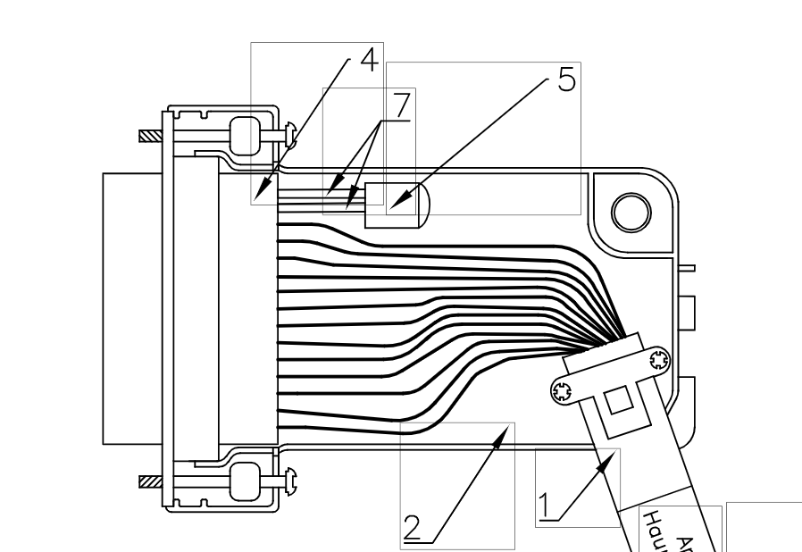
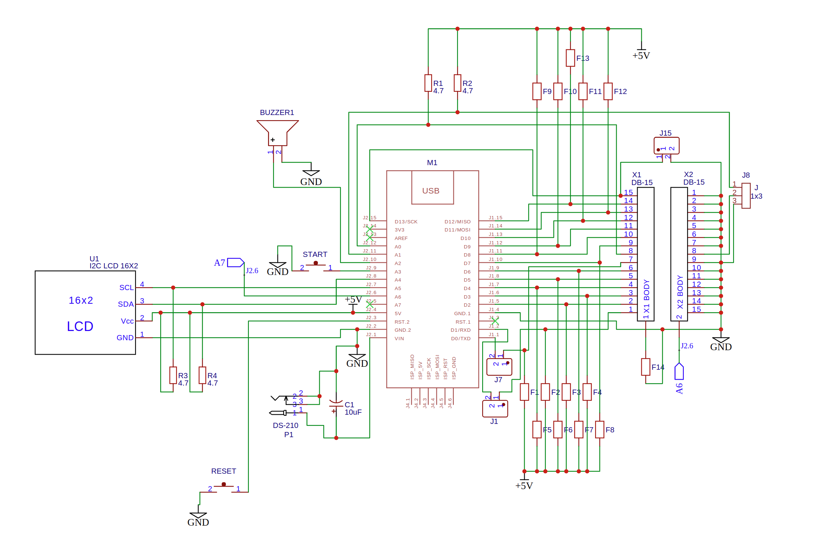

# DB15 Cable Tester for Industrial Applications

## Overview
This Arduino-based project automates the testing of DB15 cables, which are widely used in various industrial applications. The tester verifies the electrical integrity of each cable core and checks the built-in DS2401+ serial number devices on the DB15 connectors. This ensures that the cables meet quality standards before being deployed in critical industrial environments.

## Background
**Where DB15 Cables Are Used:**
- **Control Systems & Automation:** DB15 connectors are commonly found in control panels, machinery interfaces, and other industrial automation systems.
- **Instrumentation:** They are used in systems where precise data transfer and signal integrity are crucial.
- **Legacy Systems:** Many older industrial systems still rely on DB15 connectors for robust connectivity.

**Why Testing Is Important:**
- **Quality Assurance:** A reliable connection is essential in industrial settings to prevent system failures. Faulty cables can lead to unexpected downtime and costly repairs.
- **Safety:** Ensuring that every conductor in the cable is properly connected helps avoid electrical faults that could result in hazardous situations.
- **Traceability:** The DS2401+ serial number devices allow for tracking and logging of each connector, which is critical for maintenance and quality control during production.

## Project Description
The testing device follows a precise sequence to ensure the integrity of the cable:
1. **Start Sequence:** The process begins when the red "START" button is pressed.
2. **Electrical Continuity Check:** The Arduino verifies the electrical connection for each of the 12 cable cores.
3. **Serial Number Verification:** Each connector's DS2401+ device is checked via the one-wire protocol.
4. **Feedback:**
   - **Visual:** Test data is displayed on a 16x2 LCD.
   - **Audible:** A single beep indicates a successful test, while three beeps signal a malfunction.
5. **Repeatability:** Pressing the "START" button repeatedly restarts the test, while a "RESET" button reloads the device.

## Hardware Components
- **Arduino Nano:** The main controller that runs the testing firmware.
- **DS2401+ Serial Number Chips:** Integrated into the DB15 connectors for identification.
- **16x2 I2C LCD:** Displays test results and status messages.
- **Buzzer:** Provides audible feedback based on test outcomes.
- **Push Buttons:** A red "START" button to initiate the test and a "RESET" button to reload the device.

## Circuit Schematic and PCB Layout
- **PCB Schematic:**  
  The schematic for the testing device is available in the [Schematic Directory](./Schematic/). This document details the circuit design and interconnections.
- **Cable Casing Image:**  
  A visual representation of the cable casing is provided in the [Drawings Directory](./Drawings/). This image shows the housing used for the DB15 connector.
- **Two-Layer PCB Layout:**  
  Complete layout files for producing a two-layer PCB are also available in the [Drawings Directory](./Drawings/).

### Example Images
- **Cable Casing:**
  
- **PCB Schematic:**
  

## Software
The firmware is written for the Arduino Nano using the Arduino IDE. Key libraries include:
- **OneWire:** For communication with the DS2401+ devices.
- **LiquidCrystal_I2C:** For interfacing with the LCD display.

### Code Overview
- **Setup:** Initializes I/O pins, the LCD, and OneWire interfaces.
- **Testing Routine:** On pressing the "START" button, the Arduino checks the connectivity of each cable core and communicates with the DS2401+ devices.
- **Feedback Mechanism:** Based on the test results, the device provides both visual (LCD display) and audible (buzzer beeps) feedback.
- **Reset:** Pressing the "RESET" button reloads the device for a new test cycle.

For the complete source code, refer to the `wire_check.ino` file in this repository.

## Installation and Usage
1. **Hardware Assembly:**  
   Assemble the hardware according to the provided PCB schematic and layout. Refer to the images in the *Drawings* and *Schematic* directories for guidance.
2. **Firmware Upload:**  
   Use the Arduino IDE to compile and upload the provided firmware to an Arduino Nano.
3. **Testing Procedure:**  
   - Insert the DB15 cable into the tester's housing.
   - Press the red "START" button to begin the test.
   - Observe the LCD for test results and listen for the buzzer signals.
   - If needed, press the "RESET" button to restart the device.

## License
This project is open source. Feel free to modify and distribute it under the terms of the MIT License.

## Acknowledgements
Thanks to the open-source community for providing the libraries and resources used in this project.
